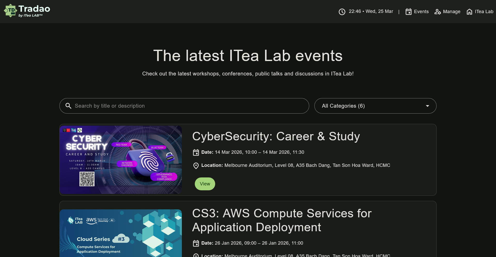
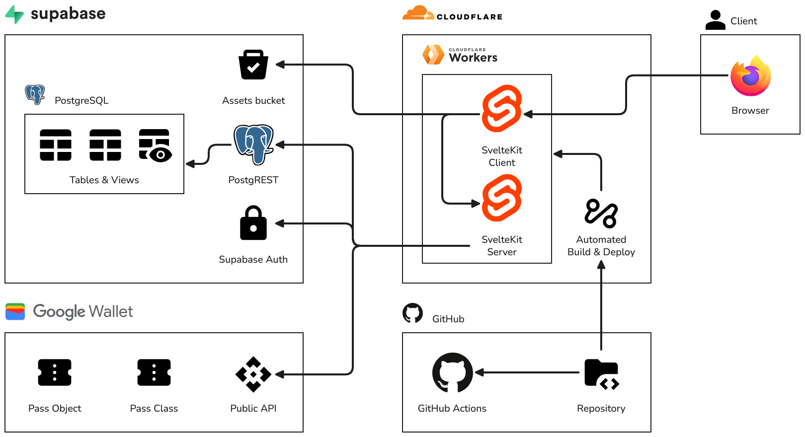

<h1>Tradao Event Management & Ticketing Platform</h1>

<h3>Dedicated to <a href="https://github.com/ITea-Lab">ITea Lab</a></h3>

	<picture>
		<source media="(prefers-color-scheme: dark)" srcset="../app/static/logos/logo_dark.svg">
		<source media="(prefers-color-scheme: light)" srcset="../app/static/logos/logo.svg">
		
	

</picture>

## Brief

This is an event management and ticketing platform dedicated to the ITea Lab student community at Swinburne Vietnam Alliance Program, HCMC location. Within the CS-oriented community, the platform streamlines the process of organising events such as workshops,

## Implementation

The system follows a simplified three-tier architecture that is composed of two main components: a full-stack web application powered by SvelteKit, and a Supabase backend-as-a-service instance.

## Getting started

### 1. Prerequisites

1. Install **Git** for version control.
2. Install **Deno** for working with the frontend and edge functions.
3. Install **Supabase CLI** to interact with Supabase, generate types and keys.
4. Install **Visual Studio Code** (or preferred tool) for to edit the source code.
5. Install **VSCode extensions**: Deno, EditorConfig, GitHub Actions.
6. Clone [TuritoYuenan/tradao-emp](https://github.com/TuritoYuenan/tradao-emp).

### 2. Configuration

1. Log in to Supabase via the CLI command `supabase login`.
2. Have access to a Supabase instance. Get the URL and **Publishable** key.
3. Have access to a Google Cloud service account. Get the account key.
4. Have access to a Google Wallet issuer account. Get the issuer ID.
5. In the `app` and `supabase/functions` directories, create a (dot ENV) `.env` file based on the respective `.env.example` templates.

### 3. Setup

1. In the `app` directory, run `npm run dev` to run the frontend locally.
2. To run in production, run `npm run build` to bundle the frontend, then `npm run preview`.
