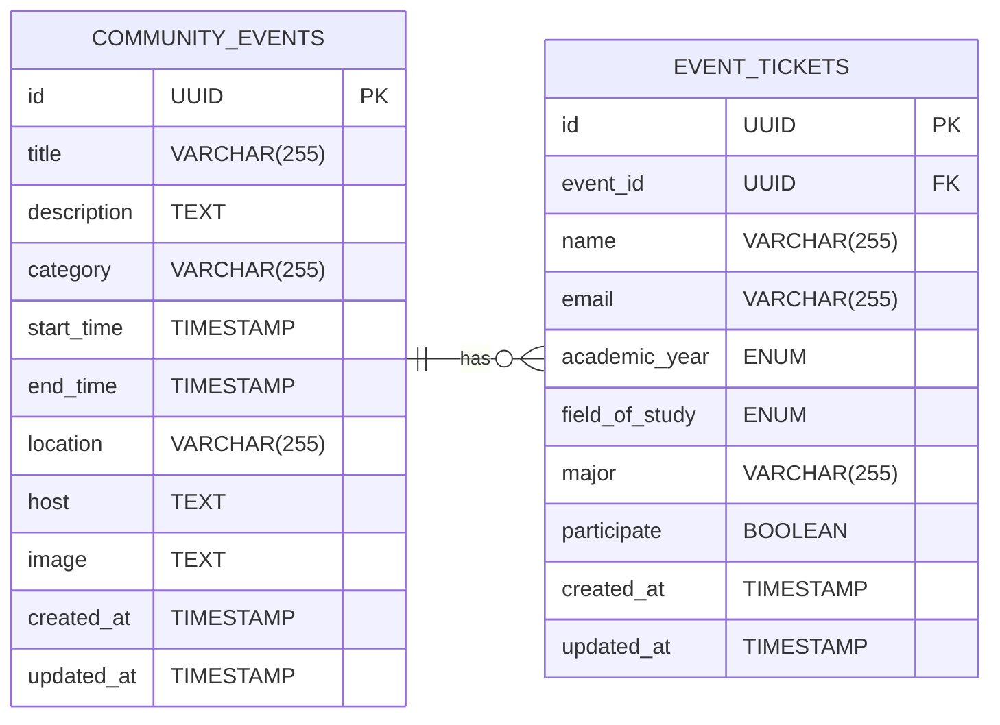

```mermaid
erDiagram
direction LR

COMMUNITY_EVENTS {
	id UUID PK
	title VARCHAR(255)
	description TEXT
	category VARCHAR(255)
	start_time TIMESTAMP
	end_time TIMESTAMP
	location VARCHAR(255)
	host TEXT
	image TEXT
	created_at TIMESTAMP
	updated_at TIMESTAMP
}

EVENT_TICKETS {
	id UUID PK
	event_id UUID FK
	name VARCHAR(255)
	email VARCHAR(255)
	academic_year ENUM
	field_of_study ENUM
	major VARCHAR(255)
	participate BOOLEAN
	created_at TIMESTAMP
	updated_at TIMESTAMP
}

COMMUNITY_EVENTS ||--o{ EVENT_TICKETS : "has"

```
